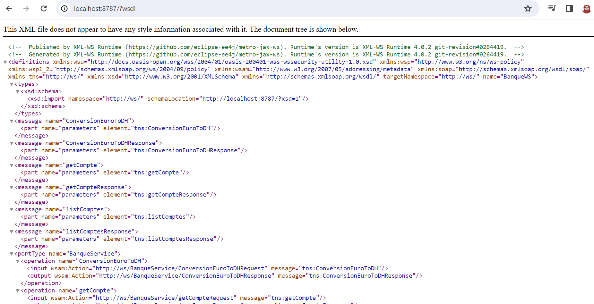
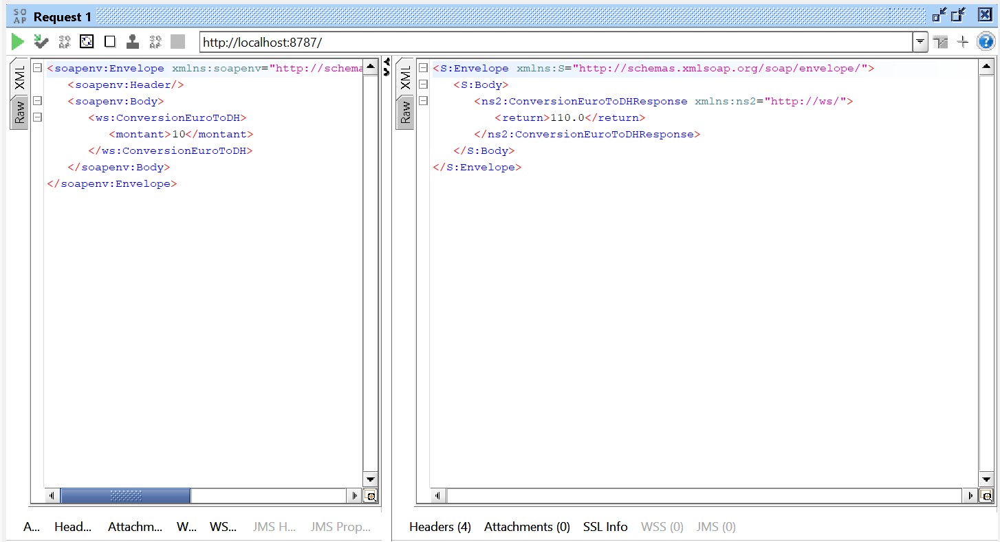
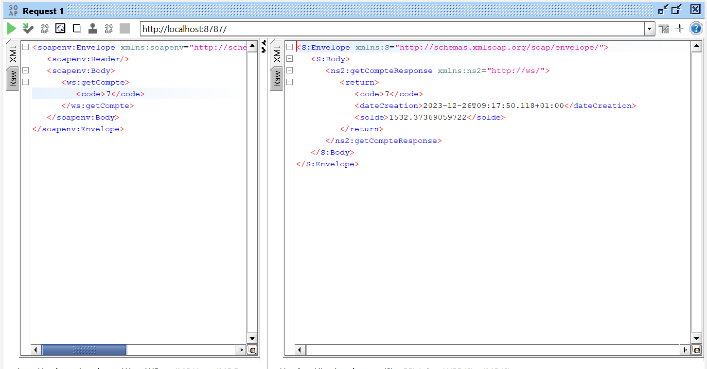
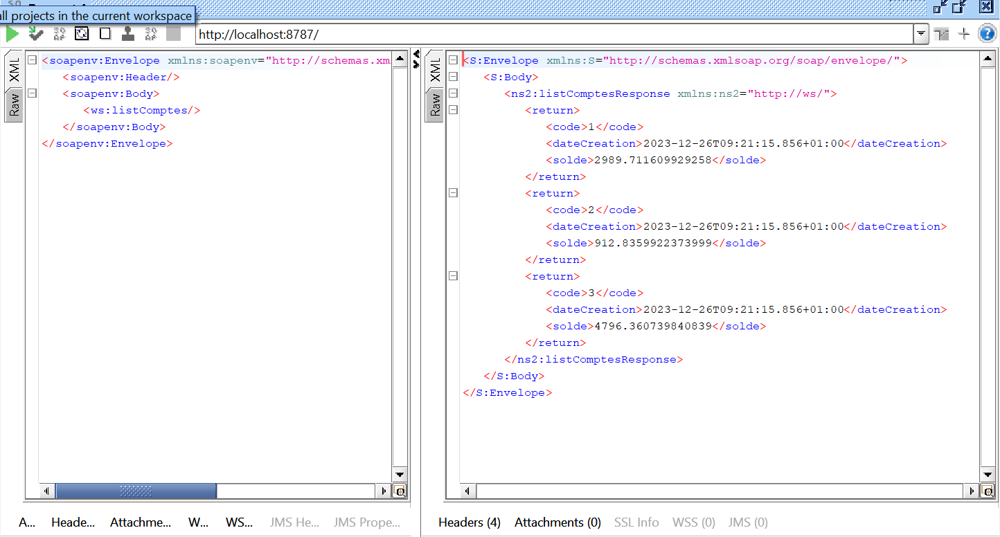

<h3> Activite pratique Web Services SOAP WSDL UDDI</h3>
<li> Déployer le Web service</li>

<li>consulter l' interface WSDL du Web service avec un browser HTTP</li>

<h4>fait une test pour  les opérations du web service avec un SoapUI</h4>
<li> l'operation conversionEuroToDH</li>

<li> l'operation getCompte</li>

<li> l'operation ListCompte </li>

